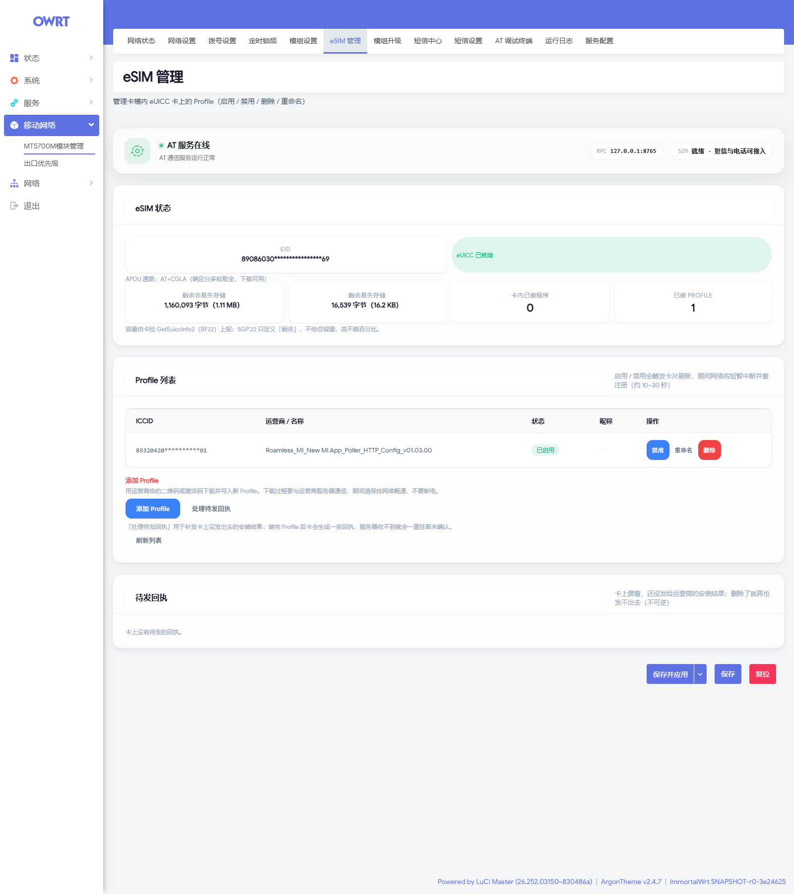
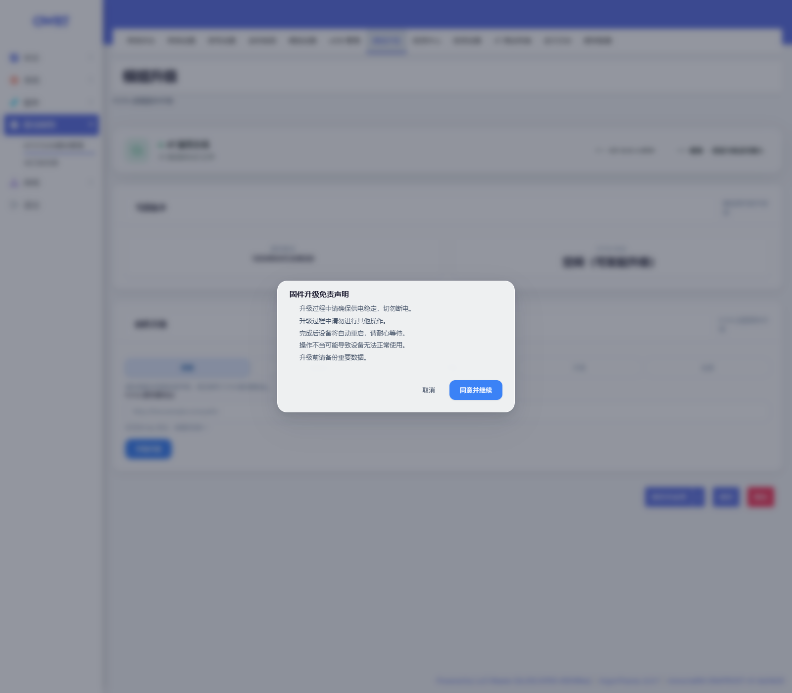
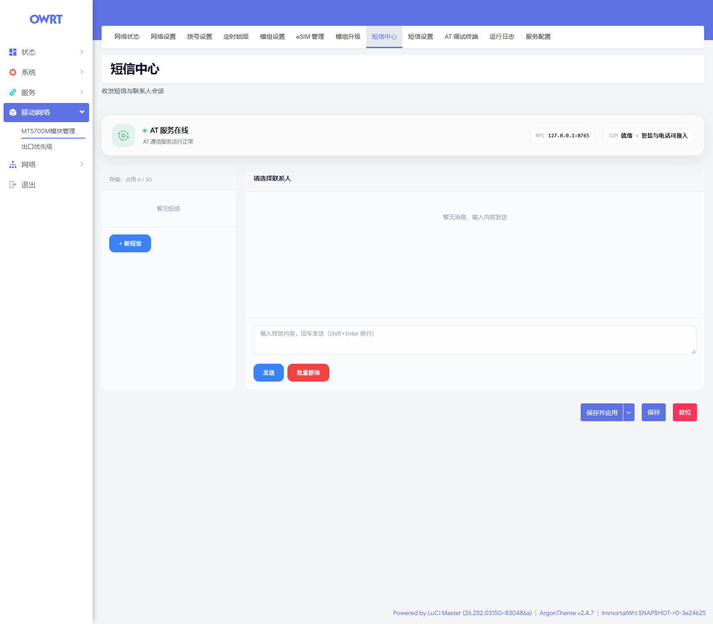
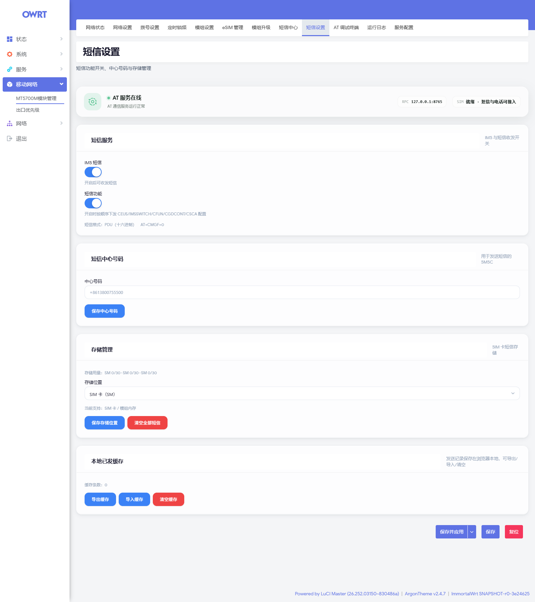
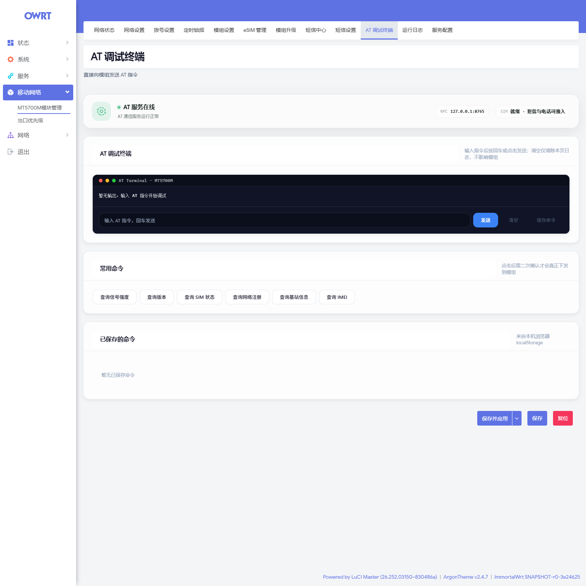
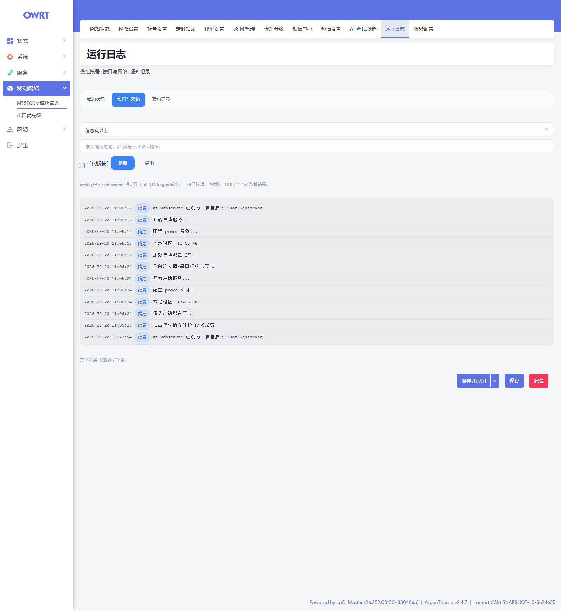
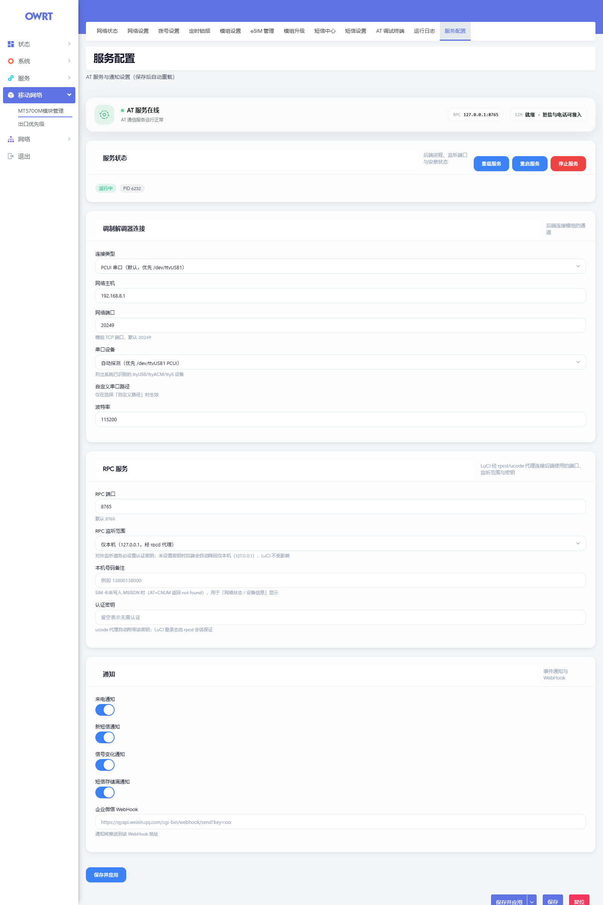

<div align="center">

# MT5700 Console

**鼎桥 MT5700M-CN 5G 模组 · OpenWrt LuCI 管理控制台**

[](LICENSE)
[](https://github.com/woshinibabao1/MT5700-Console/releases)
[](https://openwrt.org/)

信号 · 短信 · 锁频 · 拨号 · eSIM —— 常驻在路由器后台，浏览器只是它的操作台。

</div>

---


## 它是什么

一个 LuCI 插件加一个 Rust 常驻服务，把 MT5700M-CN 的 AT 能力搬进 OpenWrt：串口独占、AT 命令队列、URC 事件分发、短信 PDU 收发、定时锁频都在后台完成，页面只负责展示与下发。

| 项 | 值 |
|:--|:--|
| 包名 | `luci-app-mt5700`（单包，已内含后端二进制） |
| 服务 / 配置 | 服务 `at-webserver` · 二进制 `/usr/bin/at-webserver-rust` · UCI `/etc/config/at-webserver` |
| 链路 | LuCI → rpcd + ucode → Rust（`127.0.0.1:8765`，仅回环）→ 模组 AT |
| 默认连接 | PCUI 串口 `/dev/ttyUSB1`（TCP 备用） |
| 适用 | OpenWrt 23.05（ipk）/ 24.10+（apk）· `x86_64` · `aarch64_cortex-a53` |

> 后端只监听回环，页面经 rpcd 代理，依赖 LuCI 登录态与 ACL。

### 与手机工程模式对齐

原厂深层能力都保留了，不是「能看信号」就完事：多载波聚合（`^MONSC` / `^MONSSC` / `^HFREQINFO`）、邻区扫描（`^MONNC` / `^NRSSBID`）、网络拒绝原因（`^REJINFO`）、SIM 状态（`^SIMSQ`）、12 路温度（`^CHIPTEMP`）。

ARFCN 一列取各载波的 **SSB 频点**（与手机工程软件一致）；`^HFREQINFO` 只给载波中心频率，仅在测不到 SSB 时兜底并显示标注 —— 避免与手机抓到的数值对不上却看不出原因。

---

## 安装

从 [Releases](https://github.com/woshinibabao1/MT5700-Console/releases) 下载**与架构匹配**的主包（约 1.2 MB，已含后端）。装错架构是最常见的失败原因，先确认：

```sh
apk --print-arch                  # apk 设备（24.10+）
opkg print-architecture | tail -1 # opkg 设备（23.05）
```

> 下面示例里的版本号为当前 `2.3.27`，实际文件名以 Release 页面为准。

```sh
# OpenWrt 24.10+（apk）
apk add --allow-untrusted ./aarch64_cortex-a53-luci-app-mt5700-2.3.27-r1.apk

# OpenWrt 23.05（opkg）
opkg install ./aarch64_cortex-a53-luci-app-mt5700_2.3.27-r1_aarch64_cortex-a53.ipk
```

启用并自检：

```sh
uci set at-webserver.config.enabled=1
uci commit at-webserver && service at-webserver restart
ls -l /usr/bin/at-webserver-rust        # 后端应存在
```

浏览器进 LuCI → **移动网络 → MT5700M模块管理**。

> 中文语言包 `luci-i18n-mt5700-zh-cn-*` 可选（noarch，不装也能用）。回环 RPC 用到 busybox 的 `nc`，精简映像先 `which nc` 确认。

---

## 页面

**12 个**，都挂在「移动网络 → MT5700M模块管理」下：

| 页面 | 做什么 |
|:--|:--|
| 网络状态 | 信号质量、载波与聚合、连接诊断、地址与 DNS、SIM/设备标识、**断网排查**（31 项三层体检）、速率与流量 |
| 网络设置 | 5G 接入模式（SA/NSA）、锁频（频点 / 小区 / Band）、邻区扫描与就地锁定、网络拒绝原因 |
| 拨号设置 | 自动拨号与 APN、拨号方式与 USB 端口模式、网口模式与 DMZ、PDP 上下文管理 |
| 定时锁频 | 按夜间 / 日间时段自动切换锁频配置，配置存 UCI 由后端调度 |
| 模组设置 | 设备信息、SIM 槽位与 PIN、飞行模式、设备控制（LED / PCIe / 网卡速率）、NR 能力、网络系统配置 |
| eSIM 管理 | eUICC Profile 的下载 / 启用 / 禁用 / 重命名 / 删除，卡容量与待发回执 |
| 模组升级 | FOTA 远程固件升级 |
| 短信中心 | 收发短信与联系人会话，长短信按 UDH 自动合并成一条 |
| 短信设置 | IMS 短信开关、短信中心号码、存储位置与容量、本地已发缓存 |
| AT 调试终端 | 直接下发 AT 指令，常用命令速查，命令可存入浏览器本地 |
| 运行日志 | 模组拨号 / 接口与网络 / 通知记录三档，按级别过滤、可导出 |
| 服务配置 | 后端进程状态、连接方式（串口 / TCP）、RPC 端口与密钥、事件通知与 WebHook |

<details>
<summary><b>全部页面截图（12 张）</b> —— 均取自真机，IMEI / IMSI / ICCID / EID / 公网 IP / 小区标识已打码</summary>

<br>

<table>
<tr>
<td align="center"><b>网络状态</b><br></td>
<td align="center"><b>eSIM 管理</b><br></td>
</tr>
<tr>
<td align="center"><b>网络设置</b><br></td>
<td align="center"><b>拨号设置</b><br></td>
</tr>
<tr>
<td align="center"><b>定时锁频</b><br></td>
<td align="center"><b>模组设置</b><br></td>
</tr>
<tr>
<td align="center"><b>模组升级</b><br></td>
<td align="center"><b>短信中心</b><br></td>
</tr>
<tr>
<td align="center"><b>短信设置</b><br></td>
<td align="center"><b>AT 调试终端</b><br></td>
</tr>
<tr>
<td align="center"><b>运行日志</b><br></td>
<td align="center"><b>服务配置</b><br></td>
</tr>
</table>

</details>

---

## eSIM（eUICC）

全自研实现，**不依赖 lpac**：ES10a / ES10b / ES10c 命令在前端直接组装 APDU，经 `AT+CGLA`（2.3.22 新增的传输通路，自动降级 `AT+CSIM`）下发；2.3.26 起真机端到端下载已跑通。

- **读**：EID、Profile 列表（ICCID / 名称 / 状态 / 昵称）、卡剩余容量（`EUICCInfo2`）、待发通知
- **写**：下载安装、启用 / 禁用、重命名、删除；装完自动补发 SM-DP+ 安装回执
- **边界**：SGP.22 **没有导出已装 Profile 的接口**（防克隆是 eUICC 的安全根基），所以**没有备份 / 导出功能** —— 这是规范限制，不是没实现。删除 Profile 不可逆，页面会要求输入 AID 末 4 位才执行
- **坑位已处理**：删除前必须先禁用；逻辑通道上 `6A82` 会自动回退基本通道复核，不误判成「不是 eUICC」；`6999` 会翻译成「SIM 被复位（ISD-R 选择态丢失）」而不是「不支持此操作」

> ES9+ 走 GSMA 私有 PKI（根 `RSP2 Root CI1`），不在公开 CA 库里。包内已自带该根证书，无需 `-k` 跳过校验。

---

## 配置

配置在 `/etc/config/at-webserver`（单 section `config` + 扁平键）。常用的几个：

| 键 | 默认 | 说明 |
|:--|:--|:--|
| `enabled` | `1` | 总开关 |
| `connection_type` | `SERIAL` | `SERIAL`=PCUI 串口；`NETWORK`=TCP |
| `serial_port` | `auto` | `auto` 优先探测 ttyUSB1（PCUI） |
| `autodial_enable` | `1` | 关掉则网口拿不到 IP |
| `websocket_port` | `8765` | LuCI ↔ 后端 RPC 端口 |
| `websocket_allow_wan` | `0` | 置 `1` 会对外暴露 RPC，**务必同时设 `websocket_auth_key`** |
| `wechat_webhook` | 空 | 企业微信机器人通知 |

改完 `uci commit at-webserver && service at-webserver restart`，或在「服务配置」页点「保存并应用」。完整键（通知 / 定时锁频 / 夜间日间编排）见随包默认配置文件。

> **连接看门狗已于 2.3.25 整体移除**：原先它常驻轮询、断网后自动续约 / 复位，但在「卡上没有 Profile → 永远注册不上网」这类注定失败的场景下会持续制造 `ifdown/ifup` churn。断网排查请用「网络状态 → 断网排查」（只读体检，只给事实与建议命令，不自动动手）；网口重枚举时的 DHCP 续约仍由 hotplug 脚本 `99-mt5700-renew` **事件驱动**地做一次。

### 脚本下发 AT

后端是**裸 TCP newline-JSON**，不是 HTTP —— `curl` / `wget` 一定失败：

```sh
printf '%s\n' '{"id":1,"method":"at","params":{"cmd":"AT+CSQ"}}' | nc 127.0.0.1 8765
```

报文必须带 `id`，AT 参数名是 `cmd`；是否成功只看返回里的 `result.success`。

---

## 排障

**接口拿不到 IP** —— 九成是这两处：

```sh
uci show network.MT5700M | grep auto                 # 期望 auto='1'
printf '%s\n' '{"id":1,"method":"at","params":{"cmd":"AT^SETAUTODIAL?"}}' | nc 127.0.0.1 8765
```

**服务没起来** —— 状态标签会给出判定（运行中 / 已禁用 / 未安装 / 不可执行 / 未注册 / 已停止）：

```sh
ls -l /etc/init.d/at-webserver                       # 缺执行位会「未注册」：chmod 0755
ubus call service list '{"name":"at-webserver"}'
logread -e at-webserver | tail -30
```

**AT 终端集体无响应** —— 服务刚启动或模组重连时，8 条初始化命令占着通道；排队有独立的 8 秒预算，偶发时等几秒重试。两类超时文案不同：「等待空闲通道超时」= 命令没发出去，「模组无响应」= 已写入但模组没回。

**域名解析不了但 IP 能 ping 通** —— 与模组无关，是 DNS 链路。先查 `uci get dhcp.@dnsmasq[0].noresolv` 和 `server`：装过 mosdns / openclash 的设备常见「接管进程没运行、`noresolv` 却留着」，dnsmasq 会退化成拒绝一切递归查询。

---

## 开发

```sh
node tests/run-all.js          # 38 个测试文件，全部静态断言 + mock，无需真机
cd src/rust && cargo test      # Rust 侧
```

推 `main` 或打 `v*` 标签会触发 GitHub Actions 云编译（官方 SDK + zig 交叉编译 musl 静态链接），成功后自动发布 Release。`main` 推送用 `Makefile` 里的 `PKG_VERSION` 作版本号，四处需同步（`Makefile` / `src/rust/Cargo.toml` / `Cargo.lock` / `CHANGELOG.md`）—— 用 `python tools/bump-version.py <版本>`。

> 改 `mt5700.css` 必须同步 bump `mt5700.js` 的 `MT5700_CSS_VERSION` 与 `tests/css-cachebust-contract.test.js` 的 `CSS_FINGERPRINT`，否则用户浏览器会一直吃旧样式缓存。

---

## 许可

[MIT](LICENSE)。衍生自 [LianXia233/luci-app-mt5700](https://github.com/LianXia233/luci-app-mt5700)（MIT），保留原版权声明：

```text
Copyright (c) 2026 LianXia233
Copyright (c) 2026 MT5700 Console contributors
```

AT 行为以厂商《MT5700M-CN 5G 系列模组 AT 命令手册》为准；本项目与设备厂商无隶属关系。
