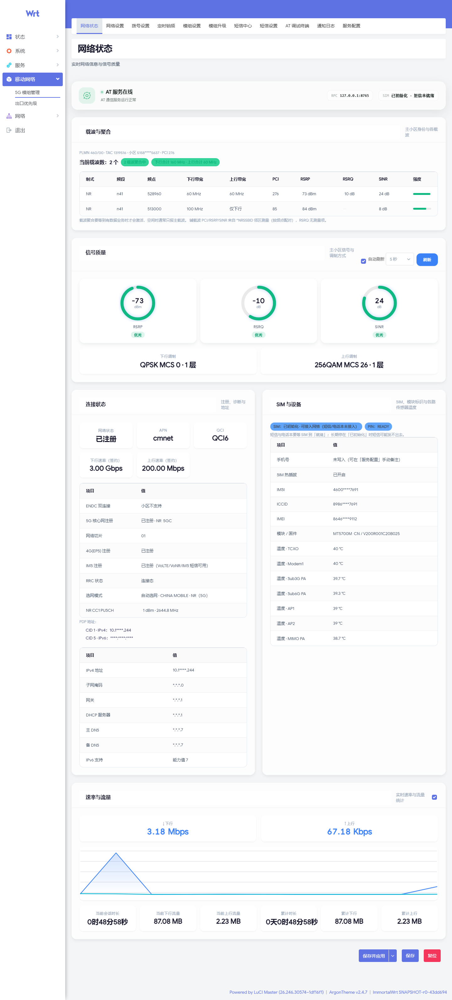
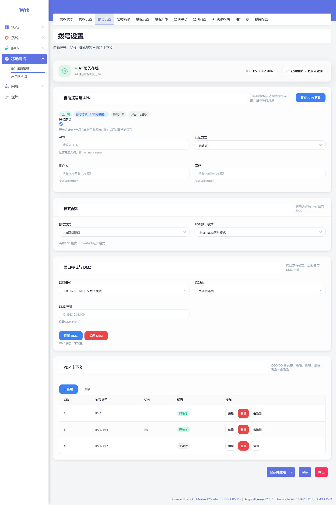
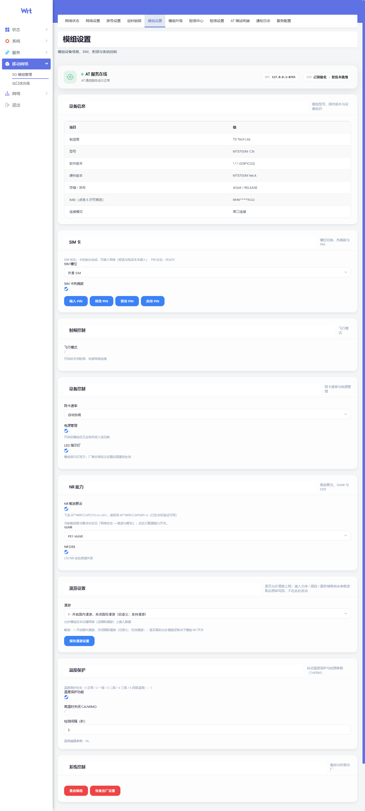
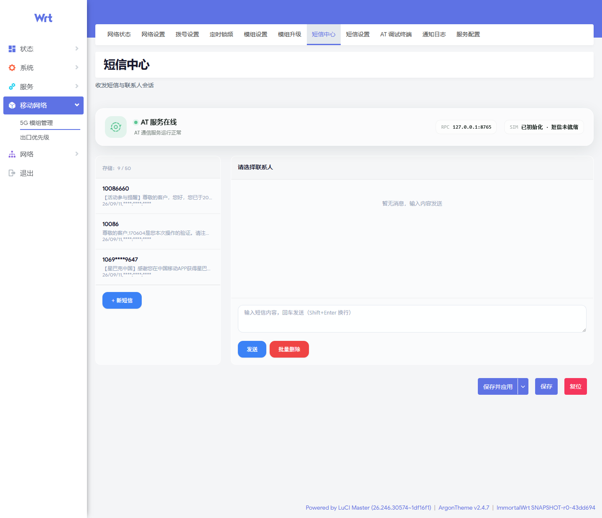
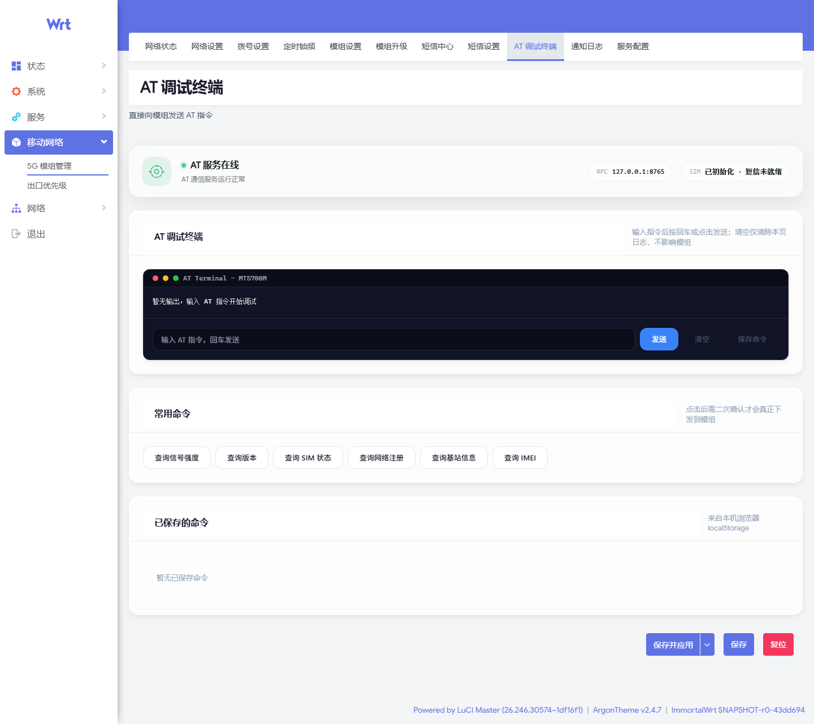
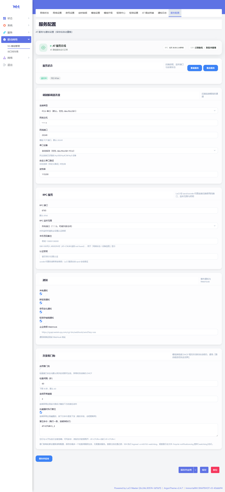

<div align="center">

# MT5700 Console

**鼎桥 MT5700M-CN 5G 模组 · OpenWrt LuCI 管理控制台**

11 个页面 · Rust 常驻后端 · 前后端单包交付

<sub>fork 自 [LianXia233/luci-app-mt5700](https://github.com/LianXia233/luci-app-mt5700)（MIT）· 当前版本 **v1.0**</sub>

</div>

---

| 项 | 值 |
|:--|:--|
| 包名 | `luci-app-mt5700` |
| 服务 / UCI 段 | `at-webserver`（后端二进制 `/usr/bin/at-webserver-rust`） |
| 架构 | LuCI → rpcd + ucode → Rust (tokio) → 模组 AT |
| 默认连接 | PCUI 串口 `/dev/ttyUSB1`（网络 TCP 备用） |
| 打包 | 单包内含页面 + 后端二进制 |
| 云编译 | GitHub Actions · x86_64 / aarch64_cortex-a53 · apk + ipk |

> **为什么叫 MT5700 Console**：它不只是「一个 LuCI 页面」——串口常开、AT 命令队列、
> URC 事件分发、短信 PDU 收发、定时锁频、通知推送都跑在常驻后端里，前端只是它的操作台。
> 包名 `luci-app-mt5700` 沿用上游以便 OpenWrt 生态识别，**仓库名与项目名**独立为 MT5700 Console。

---

## 截图

> 全部截图取自**真实设备**（MT5700M-CN / 固件 V200R001C20B025，1440px 宽，按内容完整高度截取）。
> **IMEI / IMSI / ICCID / 手机号 / IPv4 / IPv6 已打码**（保留前 4 后 4 或末段，回环地址 `127.0.0.1` 未作处理）。

### 网络状态

一张卡片铺开全部读数：信号质量、连接状态、载波与聚合、速率与流量、SIM 与设备（含各路传感器温度）。



### 其余页面

<table>
<tr>
<td width="50%"><br><sub><b>网络设置</b> · 锁频编辑器（LTE/NR 分段切换）、邻区与 SSB、接入模式</sub></td>
<td width="50%"><br><sub><b>拨号设置</b> · 自动拨号 / APN / PDP 上下文，暂存式「应用更改」</sub></td>
</tr>
<tr>
<td width="50%"><br><sub><b>定时锁频</b> · 夜间/日间时段自动切换锁频，跨零点有效</sub></td>
<td width="50%"><br><sub><b>模组设置</b> · 设备信息、SIM 槽位、射频、NR 能力、漫游、温度保护</sub></td>
</tr>
<tr>
<td width="50%"><br><sub><b>短信中心</b> · 长短信按 UDH 自动合并为一条完整消息</sub></td>
<td width="50%"><br><sub><b>AT 调试终端</b> · 直连后端 AT 通道，带常用命令与历史</sub></td>
</tr>
<tr>
<td width="50%"><br><sub><b>通知日志</b> · 短信 / 来电 / 信号事件本地留档</sub></td>
<td width="50%"><br><sub><b>服务配置</b> · 连接方式、串口、通知、看门狗、保存并应用</sub></td>
</tr>
</table>

<sub>另有 `06-upgrade.png`（模组升级 FOTA）与 `08-sms-settings.png`（短信设置）在
[`docs/screenshots/`](docs/screenshots/) 目录。</sub>

---

## 快速安装

从 [Releases](https://github.com/woshinibabao1/MT5700-Console/releases) 下载**与目标架构匹配**的主包
（约 1.2MB，已内含后端二进制）。

### OpenWrt 24.10+（apk）

```sh
# 以 aarch64_cortex-a53 为例
apk add --allow-untrusted ./aarch64_cortex-a53-luci-app-mt5700-1.0-r1.apk
```

### OpenWrt 23.05（opkg / ipk）

```sh
opkg install ./aarch64_cortex-a53-luci-app-mt5700_1.0_aarch64_cortex-a53.ipk
```

### 启动与确认

```sh
uci set at-webserver.config.enabled=1
uci set at-webserver.config.connection_type=SERIAL   # 默认 PCUI
uci set at-webserver.config.serial_port=auto         # 优先探测 ttyUSB1
uci commit at-webserver
service at-webserver restart

ls -l /usr/bin/at-webserver-rust                     # 单包自检：后端二进制应存在
```

浏览器登录 LuCI → **移动网络 → 5G 模组管理**（路径 `admin/modem/5g`），即可看到 11 个页面。

> **为何必须有后端进程？** 串口 / `AT` 通道、定时锁频、企业微信推送都必须常驻，浏览器无法完成。
> 「一个安装包」= 前后端合一；不是「一个静态 HTML」。

### 保存配置

配置修改采用**暂存式「保存并应用」**，与 LuCI 原生行为一致：

- 「服务配置」页：修改任一控件即标记「未保存更改」，点击「保存并应用」后依次执行
  `uci.changes()` → `uci.save()` → `uci.apply()`；若本来就没有待应用的变更
  （rpcd 返回 ubus 状态码 5 / NO_DATA），视为已生效，提示「无待处理的变更」而不是误报失败；
  应用成功后自动重载 at-webserver 服务并回查真实进程状态。
- 「拨号设置」页：所有写操作（自动拨号、APN、拨号方式、USB 端口模式、网口模式、
  后置路由、DMZ、PDP 上下文）先暂存，页面底部粘性条提供「撤销更改 / 应用更改」，
  仅在确认应用后配置才真正写入并生效。

---

## 功能一览

| 分组 | 页面 |
|:--|:--|
| 网络 | 网络状态 · 网络设置 · 拨号设置 · 定时锁频 |
| 模组 | 模组设置 · 模组升级 |
| 短信 | 短信中心 · 短信设置 |
| 工具 | AT 调试终端 · 通知日志 · 服务配置 |

原 WebUI 的深层能力均已保留，例如：

- 服务小区 / 多载波聚合（`^MONSC` · `^MONSSC` · `^HFREQINFO`）
- 网络拒绝原因（`^REJINFO`）实时面板
- SIM 卡状态（`^SIMSQ`）、各路传感器温度（`^CHIPTEMP`）、实时速率（网卡计数差分）
- 定时锁频（夜间 / 日间）、企业微信通知、连接看门狗

短信中心：收到的长短信（UDH 拼接短信）按「发件人 + 拼接引用号」自动合并为一条完整消息，
会话气泡不再拆成多条「片段 X/Y」，并保留原始换行；删除时一并清除所有分段。
若部分分段丢失，会尽量合并已收到的部分并提示「长短信已合并 N/M 段（部分缺失）」。

---

## 架构

```text
                    ┌─────────────────────────────────────┐
                    │                LuCI                 │
                    │  11 个页面 · L.rpc.declare('mt5700') │
                    └──────────────────┬──────────────────┘
                                       │  ubus / rpcd 会话 + ACL
                    ┌──────────────────▼──────────────────┐
                    │         rpcd + ucode 插件           │
                    │   mt5700.uc（读 UCI，附 auth_key）   │
                    └──────────────────┬──────────────────┘
                                       │  TCP newline-JSON
                                       │  仅 127.0.0.1:8765
                    ┌──────────────────▼──────────────────┐
                    │      Rust  at-webserver-rust        │
                    │  RpcServer · AtClient · Scheduler   │
                    │  URC 分发 · PDU · 短信 · 通知        │
                    └──────────────────┬──────────────────┘
                                       │
              ┌────────────────────────┼────────────────────────┐
              │                        │                        │
         /dev/ttyUSB1              192.168.8.1:20249            UCI
            (PCUI)                    (TCP 备用)           at-webserver
```

要点：

- **AT 通道的唯一持有者是 Rust 服务**：前端只能经
  `L.rpc.declare({object:'mt5700',method:'at'})` → rpcd → ucode → Rust 这条链路下发；
  前端代码里不出现 `navigator.serial` / `microcom` / 直写 `/dev/tty*`
  （已有契约测试钉住，见「本地开发与测试」）。
- **无对外监听端口**：后端只监听回环；页面经 rpcd 代理，依赖 LuCI 登录态 + ACL。
- **事件**：后端维护事件总线（`raw_data` / `new_sms` / `incoming_call` / `pdcp_data` /
  `cellscan` / `memory_full` / `urc_data`），前端约 1.5s 轮询 `events(since)`。
- **默认 PCUI**：`connection_type=SERIAL`，串口优先 `/dev/ttyUSB1`；`serial_port=auto` 时自动探测。

---

## 项目结构

```text
MT5700-Console/                      # 仓库根 = OpenWrt 单包
├── Makefile                         # PKG_NAME=luci-app-mt5700 · PKG_VERSION=1.0
├── .github/workflows/build-openwrt.yml
├── scripts/sdk-build.sh             # Actions 容器内：SDK + zig + cargo + 校验
├── docs/screenshots/                # README 用截图（已打码）
├── htdocs/luci-static/resources/
│   ├── at-webserver/                # rpc.js · parse.js · ui.js · smsEncode.js · mt5700.css
│   └── view/at-webserver/           # 11 个页面
├── root/
│   ├── etc/config/at-webserver      # UCI 默认（SERIAL / ttyUSB1）
│   ├── etc/init.d/at-webserver      # procd
│   └── usr/share/rpcd/ucode/mt5700.uc
├── src/
│   ├── Makefile                     # 编译并安装 at-webserver-rust 到本包
│   └── rust/                        # tokio 后端
└── tests/
    ├── parse-contract.test.js       # AT 应答解析契约（45 项）
    ├── ui-contract.test.js          # 样式 / 类名 / mock 保真 / AT 通道不变量（206 项）
    ├── sms-pdu.test.js              # 短信 PDU 编解码闭环（90 项）
    ├── watchdog-routing.test.js     # 看门狗 AT/Shell 分流 + 探测目标契约（52 项）
    ├── sim-heal-contract.test.js    # SIM 自愈 / 「AT 只走 Rust」契约（58 项）
    └── mock-modem/                  # 无硬件 e2e（mock AT 模组 + 真机应答样本）
```

---

## 本地开发与测试

### 契约测试（**不需要真机**）

```sh
node tests/parse-contract.test.js          # 45 项 · AT 应答 → 解析结果
node tests/ui-contract.test.js             # 206 项 · 类名↔样式、mock↔真机、AT 通道不变量
node tests/sms-pdu.test.js                 # 90 项 · 短信 PDU 编码 ↔ pdu.rs 口径 往返一致
node tests/watchdog-routing.test.js        # 52 项 · 看门狗 AT/Shell 分流 + 探测目标契约
node tests/sim-heal-contract.test.js       # 58 项 · SIM 自愈「每次开机一次」+ AT 只走 Rust
node tests/mock-modem/parse-extra-test.js  # 14 项 · REJINFO / SIMSQ / parseRawData 拆分
sh tests/watchdog-routing.test.sh          # 51 项 · 真跑分流与执行逻辑（上面那条会自动调用）
```

六套测试共 **465 项**，全部基于真实设备实测样本或厂商手册条文：

注：`sim-heal-contract` 与看门狗契约里的「默认值四处一致」都是**静态守卫**——
本机没有 `cargo`/`rustc`，Rust 侧的行为测试（假模组集成测试）在 CI 上跑，
但源码里那些「少一行就出事」的写法在这里就能钉住。

- `parse-contract`：MONSC / NRSSBID / MONNC / 注册状态 / `^SYSCFGEX` 回读 /
  `^CGPADDR` 的「16 段十进制点分 IPv6」/ `^NRRCCAPQRY` 三种 mode / COPS / VERSION。
- `ui-contract`：`Mt5700.badge/button/toast` 的每个 variant 都必须在 CSS 里有定义、
  JS 挂上的类名必须在 CSS 里存在、mock 对真机不支持的命令必须回 ERROR、
  以及**前端不得绕过 Rust 直连串口**。
- `sms-pdu`：自带一个逐行镜像 `src/rust/src/pdu.rs` 的参考解码器，做
  「编码 → 参考解码 → 与原文比对」的闭环；覆盖首字节位序（手册附录表 20-6）、
  GSM7 单条/含扩展字符/长短信、160↔161 边界、UCS2 与 emoji 代理对、
  SMSC 与 TP-DA 地址编码、国际/国内 TOA、以及「输入框提示条数 = 实际分片数」。
- `watchdog-routing`：看门狗的复位命令支持 AT 指令与本机 shell 命令两类、按行首自动分流。
  静态守卫禁止那条曾经「一条 AT 都没下发过」的 wget/HTTP 通道复活，也禁止
  `命令 && … || /bin/sh -c` 这类会把命令**执行两次**的写法；行为测试真跑分流、
  超时包装、退出码、JSON 转义与逐条顺序，并断言默认值在四处（watchdog.sh /
  `etc/config` / `uci-defaults` / `service.js`）口径一致。
  另含「探测目标可自定义」一节：默认必须是 `119.29.29.29`（腾讯 DNS）、判定收敛到
  `connectivity_ok` 单一入口、没有 `ping` 时要有回退与明示、界面必须暴露三个可编辑项。
- `sim-heal-contract`：SIM 自愈的三条硬约束都不许回退 ——
  ① **每次开机最多执行一次**（tmpfs 标记文件用 `create_new`，跨服务重启也拦得住）；
  ② **一切 AT 都走 Rust**（看门狗脚本里不许再出现 `HVSST`，也没有任何 shell 用
  `microcom`/`stty` 碰串口）；③ **`HVSST` 配对必须闭合**（`=1,0` 与 `=1,1` 之间
  不许有提前 `return`，等待也不许响应 ctx 取消）。同时钉住「卡已就绪 / 非 USB 网口模式 /
  卡不在位或已失效时跳过且**不消耗**唯一一次机会」，以及界面文案不写「电话本」。
- `parse-extra`：`^REJINFO` 拒绝原因、`^SIMSQ` 的 11/12/98 语义（11 与 12 的文案必须可区分、
  且统一写「短信与电话」不写「电话本」）、以及 `rpc.js` 的 `parseRawData` 拆分。

### Rust

```sh
cd src/rust
cargo test
cargo build --release
```

> Windows 上路径若含中文，可能影响 dlltool；建议用纯 ASCII 路径编译。

### 无硬件端到端

```sh
cd tests/mock-modem
npm install ws          # 仅测试依赖
sh run-e2e.sh           # mock 模组 + 真实 Rust + RPC 客户端
```

`tests/mock-modem/real-samples.txt` 是 **62 条只读命令的真机应答原文**（各抓两遍并标注是否稳定），
mock 的对齐一律以它为准——避免出现「mock 里能过、真机上不成立」的假通过。

### 页面语法

```sh
find htdocs -name '*.js' -exec node --check {} \;
```

---

## 云编译与发布

workflow：`.github/workflows/build-openwrt.yml` · 镜像：官方 `openwrt/sdk`

| 目标系统 | 包格式 | 架构 | 产物示例 |
|:--|:--|:--|:--|
| 主线 snapshot | `.apk` | x86_64 · aarch64_cortex-a53 | `x86_64-luci-app-mt5700-1.0-r1.apk` |
| 23.05.5 | `.ipk` | x86_64 · aarch64_cortex-a53 | `x86_64-luci-app-mt5700_1.0_x86_64.ipk` |

**触发方式**：push 到 `main` / 打 `v*` 标签 / Actions 手动 `Run workflow`。

**编译成功后自动发布 Release**：标签推送用标签名；`main` 推送用 `Makefile` 里的
`PKG_VERSION`（当前 `v1.0`）；同名 Release 先删后建；资产统一加架构前缀，避免同名冲突。

交叉编译：容器内 rustup + **zig** 作 musl 链接器；`src/Makefile` 在包编译时
`cargo build --release` 并装入 `usr/bin/at-webserver-rust`。
CI 会校验主包体积（>500KB，排除「只有前端」），并检查 4 个构建组合齐全才允许发布。

---

## UCI 配置

配置文件：`/etc/config/at-webserver`，**单 section `config` + 扁平键**（与 Rust / ucode / 服务配置页一致）。

| 键 | 默认 | 说明 |
|:--|:--|:--|
| `enabled` | `1` | 总开关 |
| `connection_type` | `SERIAL` | `SERIAL`=PCUI 串口；`NETWORK`=TCP 备用 |
| `serial_port` | `auto` | `auto` 优先探测 ttyUSB1；可填 `/dev/ttyUSB1` |
| `serial_baudrate` | `115200` | 波特率 |
| `autodial_enable` | `1` | 连上模组后确保自动拨号开启（关掉则接口拿不到 IP） |
| `autodial_mode` | `1` | `1`=USB 网络接口，`2`=转网口模式 |
| `sim_heal_enable` | `1` | SIM 卡状态自愈：`AT^SETMODE?`=4 且 `AT^SIMSQ?`≠12 时用 `HVSST` 推一次，**每次开机最多执行一次** |
| `network_host` / `network_port` | `192.168.8.1` / `20249` | 网络通道 |
| `websocket_port` | `8765` | 后端 RPC 端口（仅回环） |
| `websocket_auth_key` | 空 | 由 ucode 自动附带；空则不校验密钥 |
| `read_cache_static_ttl` | `300` | 不变类只读命令的缓存秒数（型号/固件/IMEI/ICCID…） |
| `read_cache_ttl` | `0` | 状态类缓存秒数，默认关闭（宁可取实时值） |
| `watch_enabled` | `1` | 连接看门狗总开关（默认开：只做续约，不动模组协议栈） |
| `watch_iface` | `MT5700M` | 受监控的 netifd 逻辑接口名 |
| `watch_device` | `eth2` | 该接口对应的网口（模组 USB 网口） |
| `watch_gateway` | `119.29.29.29` | 连通性探测目标（腾讯 DNS / DNSPod）；填 `none` 改为探测默认网关的邻居状态 |
| `watch_interval` | `60` | 检查间隔（秒，下限 15） |
| `watch_fail_threshold` | `3` | 连续异常多少次后触发复位动作 |
| `watch_reset_modem` | `0` | `1`=达阈值时执行 `watch_reset_cmds`（默认不启用） |
| `watch_reset_cmds` | 见下方说明 | 复位动作，多行自定义，按行首自动分流 |
| `notify_*` / `wechat_webhook` | 见默认文件 | 通知 |
| `schedule_*` | 见默认文件 | 定时锁频 |

`watch_reset_cmds` 是**多行自定义命令，按行首自动分流**（UCI 里以字面 `\n` 分隔）：

| 行首 | 走向 |
| --- | --- |
| `AT` / `at` | 作为 AT 指令经本机 RPC 下发给模组，并校验应答里的 `success`（`ATI` / `ATE0` / `AT+CFUN=1,1` / `AT^HVSST=1,0` 都算） |
| 其余任意内容 | 作为本机 shell 命令执行（`/bin/sh -c`，带 30 秒超时） |

默认值是纯 shell 的三条，先重拉接口:

```
ifdown MT5700M
sleep 2
ifup MT5700M
```

注意：AT 通道走的是后端 `127.0.0.1:8765` 的**裸 TCP newline-JSON**（不是 HTTP），
所以外部脚本要下发 AT 时不能用 `wget`/`curl` 发 HTTP POST —— 正确姿势是：

```sh
printf '%s\n' '{"id":1,"method":"at","params":{"cmd":"AT+CSQ"}}' | nc 127.0.0.1 8765
```

（配置了 `websocket_auth_key` 时，请求里要带上 `"auth_key":"…"`。）

### 看门狗的连通性判据（`watch_gateway`）

判定「到底有没有网」的目标默认是 **`119.29.29.29`（腾讯 DNS / DNSPod）**：

- **非空** → 用 ICMP（`ping -c 1 -W 2`）探测该地址 —— 最贴近实际上网体验的判据。
  刻意用**公网 IP 而不是域名**：本机有过 mosdns + OpenClash 的 DNS 劫持历史，
  用域名探测会被本地解析器误导，得出「能上网」的错误结论。
  该地址必须**回 ICMP**：不回 ping 的公共 DNS 会让看门狗永远判为「不通」。
- **填 `none`** → 回退为旧行为：自动取 `watch_device` 上默认路由的网关，查它的邻居(ARP)状态。
  （用哨兵而不是留空，是因为 `config_get` 是 `:-` 语义，空值会落回默认值，区分不出来。）
- 系统没有 `ping` 时自动回退到邻居判定，并在启动日志里明确写出。

### SIM 卡状态自愈（`sim_heal_enable`，默认开）

`AT^SIMSQ?` 只有 `<sim_status>` = 12 才算完全就绪（短信与电话可接入）；
本卡实测长期停在 `1,11`（网络可用，但短信与电话未接入）。判定与动作：

| 情况 | 行为 |
| --- | --- |
| `AT^SETMODE?` = 4 且 `AT^SIMSQ?` ≠ 12 | `AT^HVSST=1,0` → 等待 3 秒 → `AT^HVSST=1,1`，随后复核一次 |
| 卡已是 12 / 非 USB 网口模式 / 卡不在位(0)·已失效(98)·已移除(99) | 跳过，且**不消耗**「本次开机唯一一次」的机会 |

三条硬约束：

1. **每次开机最多执行一次** —— 靠 `/tmp/mt5700-simheal.done`（tmpfs）标记文件：
   服务重启、模组反复重连都不会重跑，只有设备重启（tmpfs 清空）后才重新获得一次机会。
   条件检查本身每次连上都做（纯只读，代价可忽略），但真正下发 `HVSST` 前必须先取走这次机会。
2. **一切 AT 都走 Rust** —— 命令全部经后端 `AtClient::send_command`（`/dev/ttyUSB1` 的唯一持有者）下发；
   shell 与前端都不碰串口，也没有第二条通道。
3. **`HVSST` 配对必须闭合** —— `=1,0` 之后无论应答如何都必须把 `=1,1` 发出去，
   否则 SIM 检测会一直停在关闭状态。因此两发之间的 3 秒等待刻意**不**响应服务关闭信号。

处置记录：`logread -e at-webserver | grep "SIM 自愈"`。

改配置后：

```sh
uci commit at-webserver
service at-webserver restart
# 或在 LuCI「服务配置」页点「保存并应用」（会自动 reload）
```

---

## 故障排查

### 网络接口没有 IP / 无法联网

模组显示在线但「网络 → 接口」里 `MT5700M` 拿不到地址，通常是下面两处之一：

```sh
# 1) 接口是否开机自启？autostart 必须为 true
ifstatus MT5700M | grep -E '"up"|"autostart"'
uci show network.MT5700M | grep auto      # 期望 auto='1'

# 2) 模组是否开了自动拨号？不开则网口不会下发 DHCP，接口必然没有地址
#    注意 8765 是裸 TCP newline-JSON，必须发 JSON，不能直接发 AT 文本（否则回 -32700）
printf '%s\n' '{"id":1,"method":"at","params":{"cmd":"AT^SETAUTODIAL?"}}' | nc 127.0.0.1 8765
# 期望：{"id":1,"result":{"success":true,"data":"^SETAUTODIAL: 1,1,…","error":null}}
```

`/etc/init.d/at-webserver` 的 `ensure_modem_interface()` 会幂等地把接口 `auto` 置 1
并在等待 `eth2` 就绪后 `ifup`；后端每次连上模组后也会调用 `ensure_autodial()` 对齐拨号状态
（已在目标状态则不重复下发）。两项默认值：

| UCI 键 | 默认 | 含义 |
|:--|:--|:--|
| `network.MT5700M.auto` | `1` | 开机自启接口 |
| `at-webserver.config.autodial_enable` | `1` | 连上模组后确保自动拨号开启 |
| `at-webserver.config.autodial_mode` | `1` | 1=USB 网络接口，2=转网口模式 |
| `at-webserver.config.sim_heal_enable` | `1` | 连上模组后按需执行一次 SIM 自愈（每次开机最多一次） |

手动触发一次对齐：

```sh
/etc/init.d/at-webserver start      # 走完整 start_service + ensure_modem_interface
logread -e at-webserver | tail -20
```

### 服务状态怎么看

「服务配置」页顶部的状态标签按以下优先级判定，并附带原因提示：

| 状态 | 颜色 | 含义与处理 |
|:--|:--|:--|
| 运行中 | 绿 | procd 实例存活，标签旁附带 PID |
| 已禁用 | 灰 | UCI `enabled=0`，服务被刻意关闭 |
| 未安装 | 红 | 找不到 `/usr/bin/at-webserver-rust`，需重装软件包 |
| 不可执行 | 红 | 二进制缺少执行位，执行 `chmod 0755` |
| 未注册 | 橙 | 已启用且二进制正常，但 procd 无实例——通常是 `/etc/init.d/at-webserver` 缺失或被 overlay 白化 |
| 已停止 | 红 | 实例已注册但进程未运行，查日志后重载 |

排查命令：

```sh
# 服务脚本是否还在？（ROM 里应有，overlay 不得有白化设备）
ls -l /etc/init.d/at-webserver /rom/etc/init.d/at-webserver
ls -l /overlay/upper/etc/init.d/at-webserver   # c--------- 0,0 即为白化，需删除该白化节点

# procd 注册状态与进程
ubus call service list '{"name":"at-webserver"}'
ps w | grep at-webserver-rust | grep -v grep

# 不经 init 脚本，直接用 ubus 拉起（init 脚本缺失时的应急路径，页面「重载服务」按钮即走此路）
ubus call service set '{"name":"at-webserver","instances":{"instance1":{
  "command":["/usr/bin/at-webserver-rust"],"respawn":["3600","5","5"],
  "stdout":true,"stderr":true}}}'

# 日志
logread -e at-webserver | tail -30
```

### AT 终端「命令无响应」

现象：AT 调试终端里 `ATI` 能正常返回，其余命令全部无任何回复（既无结果也无报错）。

根因：后端的命令应答超时（2s）**从进入发送函数就开始计时**，而函数内部要先「等命令通道空闲」
→「等 100ms 命令间隔」→「才写入命令等应答」。服务刚启动或模组重连时，`init_modem()`
会连续下发 8 条初始化命令（`AT+CMEE=2`、`AT+CNMI?/=`、`AT+CMGF?/=`、`AT+CLIP=1`、
`AT^SETAUTODIAL?/=`）并全程持有通道锁，用户命令的 2 秒预算被排队耗尽，命令根本没写进模组。
因此只在该时间窗内的命令会集体静默失败。

排队等待已改用独立预算（8s），不再挤占应答超时；两类失败也给出不同文案：

| 返回文案 | 含义 | 处理 |
|:--|:--|:--|
| 等待空闲通道超时（8s）：模组正忙或正在重连，请稍后重试 | 命令尚未发出，通道被占用 | 等待数秒后重试 |
| 模组无响应（已等待 2000ms）：`<命令>` | 命令已写入，模组未按时终结 | 检查命令语法与模组状态 |
| 模组未返回内容：`<命令>` | 模组直接回空行 | 确认模组是否已就绪 |

若仍偶发失败，先确认最近是否有服务重启：

```sh
logread -e at-webserver | tail -30
# 观察是否有 init_modem 初始化序列紧随其后
```

### 签约速率显示异常

现象：「网络状态」页「连接状态」面板与「实时速率」面板的下行/上行速率显示为极小的数值
（如 `819 bps`），与实际签约带宽（如 100 Mbps 档）明显不符。

根因：同一组速率状态变量被**两种物理单位不同的数据源**共用，而格式化函数只实现了其中一种口径。

| 数据源 | 来源字段 | 物理单位 | 正确换算 |
|:--|:--|:--|:--|
| 网卡实时速率 | 接口统计差分 | 字节/秒 | ×8 得 bps |
| 签约速率 | `AT^DSAMBR` 第 2/3 字段 | kbps（本身即比特单位） | ×1000 得 bps |

`AT^DSAMBR` 按手册 16.17 节定义为 `^DSAMBR: <cid>,<DlApnAmbr>,<UlApnAmbr>`，
两者单位均为 **kbps**（实机返回 `^DSAMBR: 1,102400,102400,...` 即下行 102.40 Mbps）。
修复后按**面板语义**拆成两组彼此独立的变量：

| 面板 | 数据来源 | 单位口径 |
|:--|:--|:--|
| 连接状态 | `AT^DSAMBR` 签约速率 | `kbps`（×1000） |
| 实时速率 | OpenWrt 接口统计差分 | `bytes`（×8） |

「实时速率」**不下发任何 AT 命令**：直接读 `/sys/class/net/<dev>/statistics/{rx,tx}_bytes`
做两次采样差分（1 秒一次），设备名由 `uci get network.MT5700M.device` 自动探测（实机为 `eth2`），
取不到时回退 `eth2`。该读取经 ubus 方法 `mt5700 netrate` 暴露，前端不占 AT 通道。

### 长短信显示成多条「片段」

收到长短信（UDH 拼接短信）时按「发件人 + 拼接引用号」合并；部分分段丢失时会提示
「长短信已合并 N/M 段（部分缺失）」。若看到仍未合并的片段，多半是拼接引用号不同
（不同发送时间的两条独立长短信），属正常表现。

---

## Rust 后端

| 模块 | 职责 |
|:--|:--|
| `main.rs` | 装配与优雅退出 |
| `rpcserver.rs` | TCP RPC、伪命令、事件总线 |
| `atclient.rs` | 命令串行、超时预算、URC 分流、连上模组后对齐自动拨号 |
| `transport.rs` / `serial_*.rs` | TCP / 串口通道 |
| `pdu.rs` | SMS PDU 解码（`decode_incoming_pdu`）+ GSM7 扩展表 |
| `urc.rs` | 来电 / 短信 / 信号等主动上报 |
| `schedule.rs` / `schedconfig.rs` | 定时锁频（夜间跨零点判断） |
| `notify.rs` | 本地日志与 WebHook 推送 |
| `config.rs` | UCI 读取 |

依赖：`tokio` · `serde` · `chrono` · `ureq` · `libc` 等。
Release：`opt-level=s` + LTO + strip，musl 静态链接，适合嵌入式。

---

## 上游与许可

本项目 **fork 自 [LianXia233/luci-app-mt5700](https://github.com/LianXia233/luci-app-mt5700)**，
在其 LuCI 页面与 Rust 后端基础上继续开发：补齐/修正 AT 应答解析、重构短信 PDU 编码、
清理无效功能与重复查询、收紧轮询与样式契约，并补充三套不依赖真机的契约测试。

原项目的版权与许可一并保留：

```text
Copyright (c) 2026 LianXia233
Copyright (c) 2026 MT5700 Console contributors
```

以 **[MIT License](LICENSE)** 发布（Rust 后端在 `Cargo.toml` 中同样声明 `license = "MIT"`，两层一致）。

**MT5700M** 相关 AT 行为以厂商《MT5700M-CN 5G 系列模组 AT 命令手册》为准；
本项目在无官方 OpenWrt 包源的前提下提供管理界面与后端。
